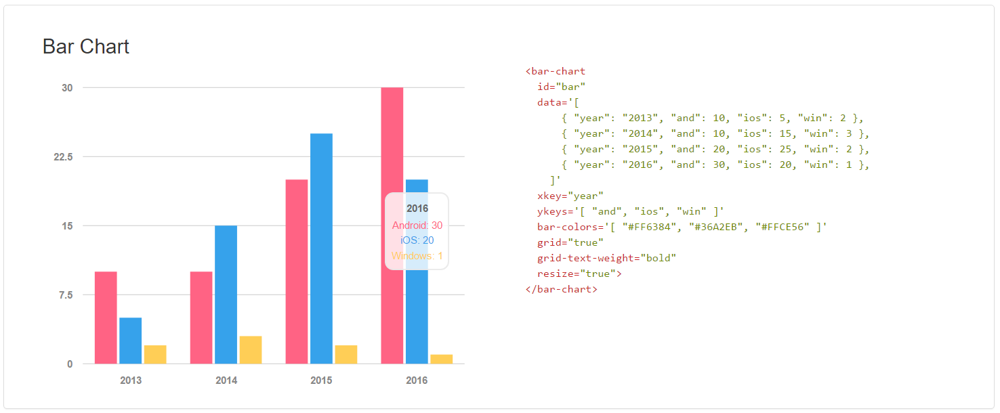
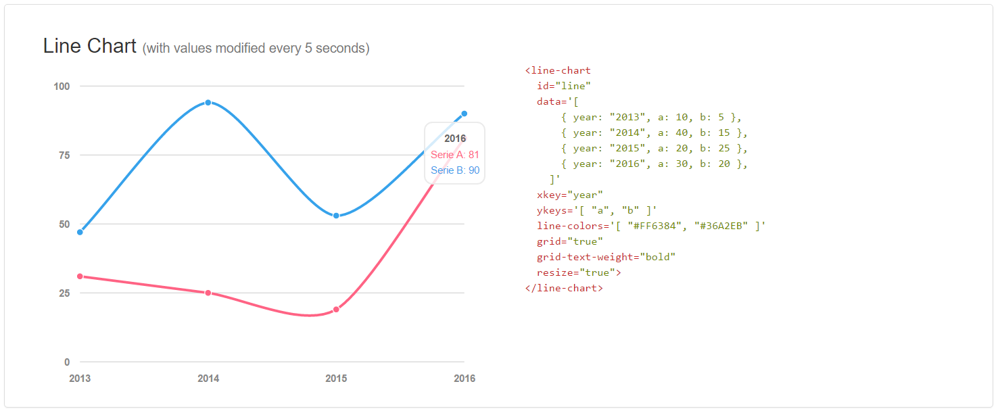
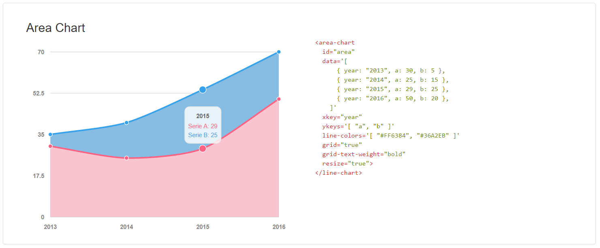

# vue-morris

> Vue.js components wrapping Morris.js lib
> 
> See http://morrisjs.github.io/morris.js/ for documentation

> Depends on Vue.js v2.1.0+
 
## Install

Use npm

```bash
npm install vue-morris --save
```

Do not forget to declare jQuery in your `package.json` and, if you are using Webpack, you should have something like that in your `webpack.config.js` 

```javascript
resolve: {
    alias: {
      'vue$': 'vue/dist/vue.common.js',
      'jquery': 'jquery/src/jquery.js'
    }
  },
```

## Examples
For a complete example, see files in `examples` directory or the project: https://github.com/bbonnin/vue-morris-example.

* Import the component

```javascript
// Do not forget to import raphael
import Raphael from 'raphael/raphael'
global.Raphael = Raphael

import Vue from 'vue'
import { DonutChart } from 'vue-morris'

new Vue({
  el: '#app',

  data: {
    donutData: [
      { label: 'Red', value: 300 },
      { label: 'Blue', value: 50 },
      { label: 'Yellow', value: 100 }
    ],

    components: {
    DonutChart, BarChart, LineChart, AreaChart
  }
})
```

* Use the component in html
```html
<donut-chart 
  id="donut" 
  :data="donutData" 
  colors='[ "#FF6384", "#36A2EB", "#FFCE56" ]' 
  resize="true">
</donut-chart>
```

* Bar chart


* Line chart


* Area chart


* Donut chart


## Build Setup

``` bash
# install dependencies
npm install

# serve with hot reload at localhost:8080
npm run dev

# build for production with minification
npm run build
```


